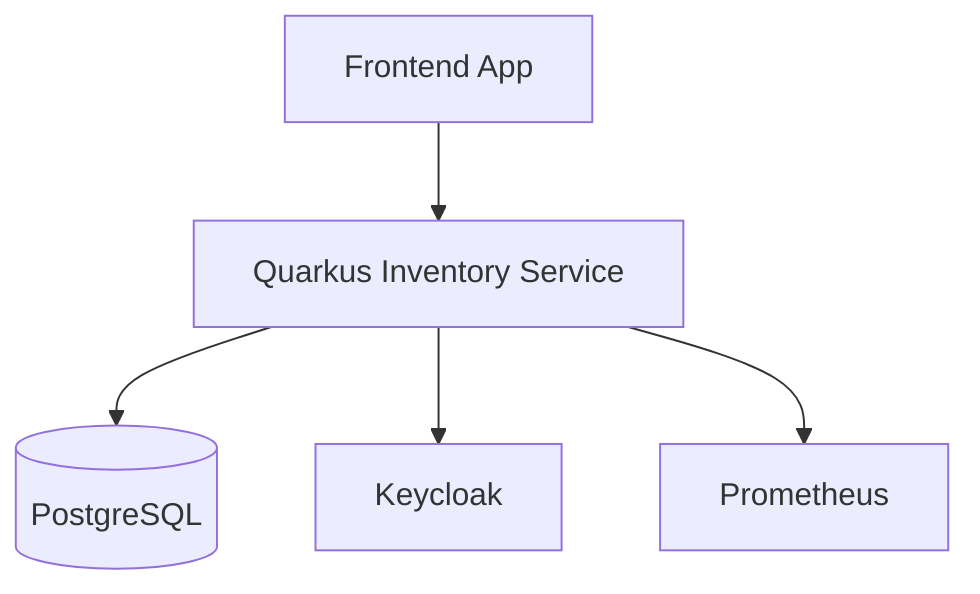

# System Architecture

## Modules

- **REST Layer** – Exposes endpoints for inventory manipulation
- **Persistence Layer** – JPA & Hibernate ORM with Panache
- **Security** – JWT with RBAC
- **Metrics** – Prometheus & Micrometer integration
