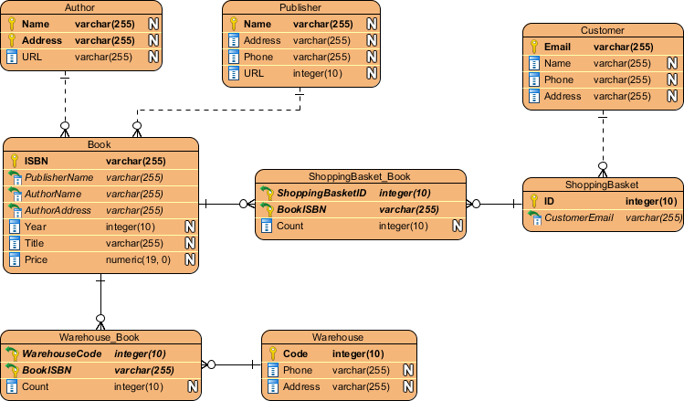

# Database Design

We use PostgreSQL with JPA & Hibernate Panache.

## ER Diagram



## Entity: Item

```java
@Entity
public class Item extends PanacheEntity {
  public String name;
  public String sku;
  public int quantity;
  public String location;
}
```

## Migrations

Managed via [Flyway](https://flywaydb.org/)

```bash
mvn flyway:migrate
```
